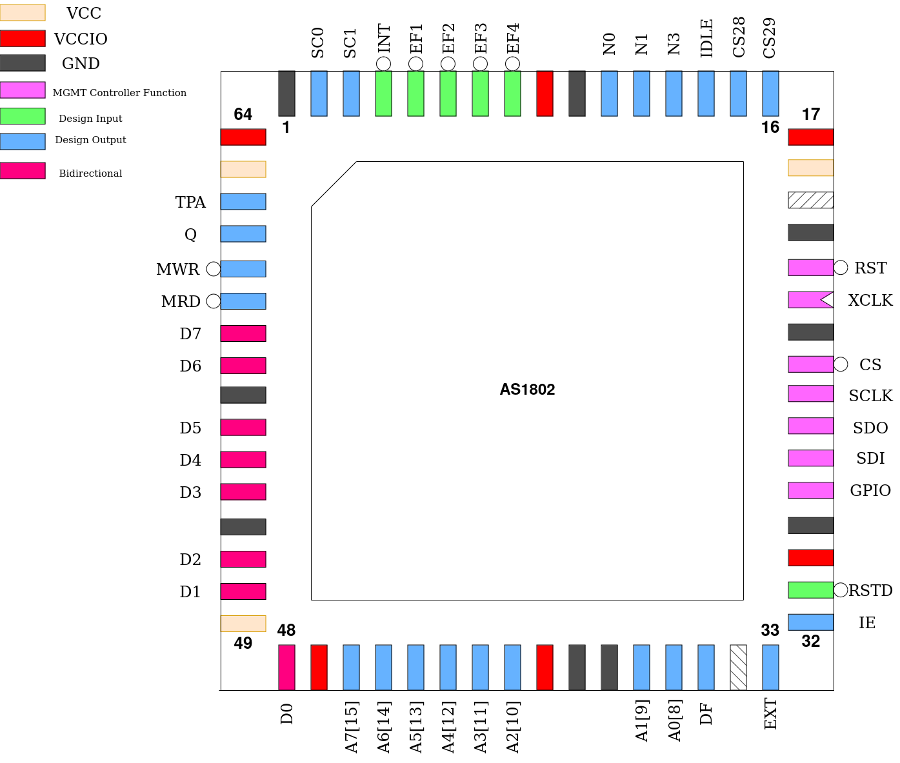

.. _as1802:

AS1802
======

This design is a binary-compatible replica of the CDP1802 microprocessor. It is, however, not bus-cycle accurate and thus distinguished with a different letter prefix in its name. Instead, this is a more optimized implementation with faster machine- and bus-cycles, executing most instructions in 1 or 2 clock cycles after a 2 or 3 clock cycle fetch.

The instruction set has also been extended, though this does not break backwards compatibility with the original CDP1802 bytecode.

Any pins not directly used by the processor have been assigned to expose some of the processor’s internal state for debugging (and blinkenlights).

DMA is currently not implemented.

------
Pinout
------

.. list-table:: Pin description
    :name: pin-description-1802
    :header-rows: 1

    * - Pin #
      - Name
      - Type
      - Summary
    * - ``mprj_io[0]``
      - RSTD
      - I
      - Active low design reset
    * - ``mprj_io[1]``
      - IE
      - O
      - Interrupt Enable state
    * - ``mprj_io[2]``
      - EXT
      - O
      - Extended ISA Cycle flag
    * - ``mprj_io[4]``
      - DF
      - O
      - Accumulator Flag state
    * - ``mprj_io[12:5]``
      - A[7:0] / A[15:8]
      - O
      - Multiplexed Address Bus
    * - ``mprj_io[20:13]``
      - D[7:0]
      - IO
      - Bi-directional Data Bus
    * - ``mprj_io[21]``
      - MRD
      - O
      - Memory Read Enable
    * - ``mprj_io[22]``
      - MWR
      - O
      - Memory Write Strobe
    * - ``mprj_io[23]``
      - Q
      - O
      - Q-Latch
    * - ``mprj_io[24]``
      - TPA
      - O
      - High Address Strobe
    * - ``mprj_io[26:25]``
      - SC[1:0]
      - O
      - Processor Status Code
    * - ``mprj_io[27]``
      - INT
      - I
      - Interrupt Request
    * - ``mprj_io[31:28]``
      - EF[4:1]
      - I
      - Event Flag general-purpose inputs
    * - ``mprj_io[34:32]``
      - N[2:0]
      - O
      - IO Instruction Address Bus
    * - ``mprj_io[35]``
      - IDLE
      - O
      - Processor Idle state indicator
    * - ``mprj_io[37:36]``
      - CS[29:28]
      - O
      - Mirror of custom_settings[29:28]

----------
Memory Bus
----------

The signaling for memory accesses is almost identical to the CDP1802, with the 16-bit address being multiplexed on 8 pins, using ``TPA`` to indicate when the most-significant byte is emitted and needs to be latched.

The only changes are less overall clock cycles to complete a bus cycle and that the processor now internally keeps track of what MSB address value was last latched, and skips emitting the MSB if it has not changed, saving a clock cycle.

.. wavedrom::

  {signal: [
    {name: 'CLK', wave: 'n........', period: 2},
    {name: 'TPA', wave: '01.0..............'},
    {name: 'A', wave: 'x5...7.5.......7.x', data: 'addr[15:8] addr[7:0] addr[7:0] addr[7:0]'},
    {name: 'D', wave: 'x....8.x...9.x.8.x', data: 'D[7:0] D[7:0] D[7:0]'},
    {name: 'MRD', wave: '10.....1.0...1.0.1'},
    {name: 'MWR', wave: '1..........0.1....'}
  ],config: { hscale: 1 }}
  
Timings of an instruction fetch and execution resulting in a write to the same 256-byte region and fetch of the following instruction.

---------------------
Extended Instructions
---------------------

The original CDP1802 had only one unused opcode, ``86h``, which is used in the AS1802 as a prefix for the extended instructions. These are as follows.

Most importantly, hardware multiple/divide instructions were added which each take only 1 clock cycle to execute. To facilitate this, one additional 8-bit register has been added to the AS1802: ``MHI`` (Muldiv High byte).

SWAP
----

Opcode: ``86h 7Bh``

Swap nibbles.

Swaps the most significant and least significant 4-bit halves of ``D`` atomically.

CMHI
----

Opcode: ``86h A0h``

Clear MHI.

Clears ``MHI`` to 0.

LMHI
----

Opcode: ``86h A1h``

Load MHI.

Copies the value of ``D`` into ``MHI``.

GMHI
----

Opcode: ``86h 90h``

Get MHI.

Copies the value of ``MHI`` into ``D``.

PXN
---

Opcode: ``86h Bnh``

Put into X Rn.

Copies the value of a general-purpose register ``n`` into the current X register.

DBNZ
----

Opcode: ``86h 2nh``

Decrement Rn and long-branch if not zero.

Decrements the value of a general-purpose register ``n`` and long-branches if the *new* register value is not equal to 0.

MUL
---

Opcode: ``86h F4h``

Multiply.

Multiplies ``D`` and a value from memory pointed to by the current X register. The result is 16-bits wide, with the LSB stored in ``D`` and the MSB stored in ``MHI``.

MLI
---

Opcode: ``86h FCh``

Multiply immediate.

Multiplies ``D`` and a immediate value from the instruction. The result is 16-bits wide, with the LSB stored in ``D`` and the MSB stored in ``MHI``.

DIV
---

Opcode: ``86h F5h``

Divide.

Divides a 16-bit value formed by concatenating ``MHI`` (MSB) and ``D`` (LSB) by a 8-bit value from memory pointed to by the current X register. The result is 16-bits wide, with the LSB stored in ``D`` and the MSB stored in ``MHI``.

DVI
---

Opcode: ``86h FDh``

Divide immediate.

Divides a 16-bit value formed by concatenating ``MHI`` (MSB) and ``D`` (LSB) by a 8-bit immediate value from the instruction. The result is 16-bits wide, with the LSB stored in ``D`` and the MSB stored in ``MHI``.

MOD
---

Opcode: ``86h F3h``

Modulo.

Computes the remainder of a division of a 16-bit value formed by concatenating ``MHI`` (MSB) and ``D`` (LSB) by a 8-bit value from memory pointed to by the current X register. The result is 8-bits wide and stored in ``D``.

MDI
---

Opcode: ``86h FBh``

Modulo immediate.

Computes the remainder of a division of a 16-bit value formed by concatenating ``MHI`` (MSB) and ``D`` (LSB) by a 8-bit immediate value from the instruction. The result is 8-bits wide and stored in ``D``.

---------------
Custom Settings
---------------

This design makes extensive use of the custom settings register as follows:

.. wavedrom::

    { "reg": [
      {"name": "PC[15:0]", "bits": 16},
      {"name": "X[3:0]", "bits": 4},
      {"name": "P[3:0]", "bits": 4},
      {"name": "MWR", "bits": 2},
      {"name": "TR", "bits": 1},
      {"name": "TW", "bits": 1},
      {"name": "CS", "bits": 2},
        {"type": 1, "bits": 2}],
    "config": {"hspace": 700}
    }

``PC`` determines the initial value of the Program Counter when the processor is reset.

``X`` and ``P`` determine the initial values of the ``X`` and ``P`` registers when the processor is reset.

As custom settings is reset to 0 on regular power-up, the behavior of the original CDP1802 is set by default.

``MWR`` determines the shape of the ``MWR`` signal. With its default value of 0, this signal stretches a full clock cycle. Other possible settings are:

``1``: WEb strobes only during the low period of the clock

``2``: WEb strobes only during the high period of the clock

``TR``, if set, additionally gates the signal ``MRD`` by the value of ``TPA``, forcing it into the inactive state when ``TPA`` is active. This is strangely not the default behavior on the CDP1802.

``TW``, if set, additionally gates the signal ``MWR`` by the value of ``TPA``, but this should not be required as these signals never overlap.

``CS`` determines the state of the ``CS[29:28]`` pins.
