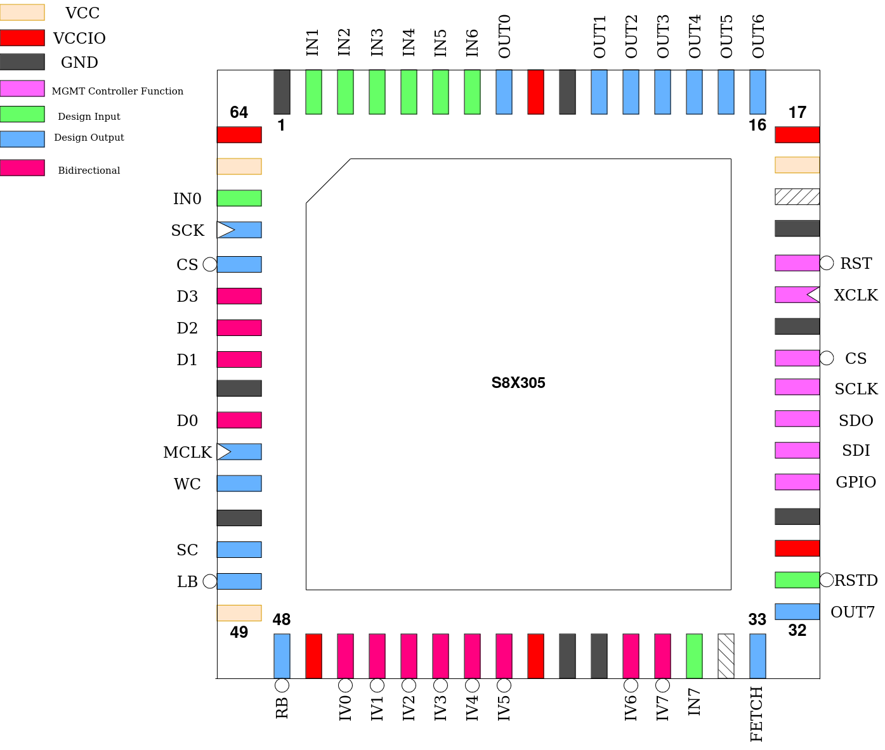

.. _s8x305:

S8X305
======

This design is a replica of the `S8X305 <https://en.wikipedia.org/wiki/Signetics_8X300>`__. The IV-Bus is a cycle-accurate recreation of the original. However, there are not enough pins on caravel to implement the Instruction-Bus. Instead, a interface to a serial ROM is provided and the remaining pins used for built-in input- and output ports. There is also 16 bytes of on-die RAM.

The only difference is notation. Here, ``IV7`` is the most-significant bit and ``IV0`` the least-significant. The `original datasheet <https://files.tholin.dev/Public/Datasheets/CPUs/8-bit/8x305_Users_Manual_Jun82.pdf>`__ uses reverse numbering, stating ``IV0`` as the most-significant bit and ``IV7`` as the least-significant.

------
Pinout
------

.. list-table:: Pin description
    :name: pin-description-s8x305
    :header-rows: 1

    * - Pin #
      - Name
      - Type
      - Summary
    * - ``mprj_io[0]``
      - RSTD
      - I
      - Active low design reset
    * - ``mprj_io[1]``
      - OUT[7]
      - O
      - Output port, bit 7
    * - ``mprj_io[2]``
      - FETCH
      - O
      - Strobes at the end of every instruction fetch
    * - ``mprj_io[4]``
      - IN[7]
      - I
      - Input port, bit 7
    * - ``mprj_io[12:5]``
      - IV[0:7]
      - IO
      - Bi-directional data bus
    * - ``mprj_io[13]``
      - RB
      - O
      - Right bank select
    * - ``mprj_io[14]``
      - LB
      - O
      - Left bank select
    * - ``mprj_io[15]``
      - SC
      - O
      - Set Command strobe
    * - ``mprj_io[16]``
      - WC
      - O
      - Write Command strobe
    * - ``mprj_io[17]``
      - MCLK
      - O
      - Memory Clock
    * - ``mprj_io[21:18]``
      - D[3:0]
      - IO
      - Spiflash data lines
    * - ``mprj_io[22]``
      - CS
      - O
      - Spiflash chip select
    * - ``mprj_io[23]``
      - SCK
      - O
      - Spiflash serial clock
    * - ``mprj_io[30:24]``
      - IN[6:0]
      - I
      - Input port, bits 0-6
    * - ``mprj_io[37:31]``
      - OUT[6:0]
      - O
      - Output port, bits 0-6

------------------
Spiflash Interface
------------------

In place of the I-Bus, a interface to a 25Qxx series spiflash is provided instead. 16-bit wide instructions are stored in big-endian format on this ROM, which is then brought up in QSPI mode for maximum bandwidth.

To verify compatibility of a specific spiflash part, check that this command sequence puts it into QSPI mode and starts a quad read:

``FFh`` (ignore if part does not have this command)

``ABh``

``06h 01h 02h 02h``

``EBh [now in quad mode] 00h 00h 00h 00h 00h 00h A5h``

-------------------
Built-in IO and RAM
-------------------

The S8X305 contains 16 bytes of on-die RAM as well as one byte-wide output port and one byte-wide input port.

As these are memory-mapped to the IV-Bus and override accesses to specific addresses, they are disabled by default so the IV-Bus is fully available externally. The Custom Settings Register is used to enable one or both of these features:

.. wavedrom::

    { "reg": [
      {"name": "INP", "bits": 1},
      {"name": "MEM", "bits": 1},
        {"type": 1, "bits": 30}],
    "config": {"hspace": 900}
    }

``INP`` enables the use of the input port. If set, reading from address ``00h`` on the **left** bus results in the read value being the state of the ``IN[7:0]`` pins.

``MEM`` enables the use of the 16 bytes of RAM which are mapped to the first 16 addresses of the **right** bus, responding to both reads and writes.

External IV-Bus cycles, both reads and writes, will still take place during accesses to the IO ports and on-die RAM, but values read from the external bus will be ignored.

For this reason, the output port is always active, responding to writes to address ``00h`` on the **left** bus, putting the written value on the ``OUT[7:0]`` pins. These pins can simply be ignored in cases where this feature isn’t needed. Reads from this location will fetch data from the external bus if ``INP`` is clear.
