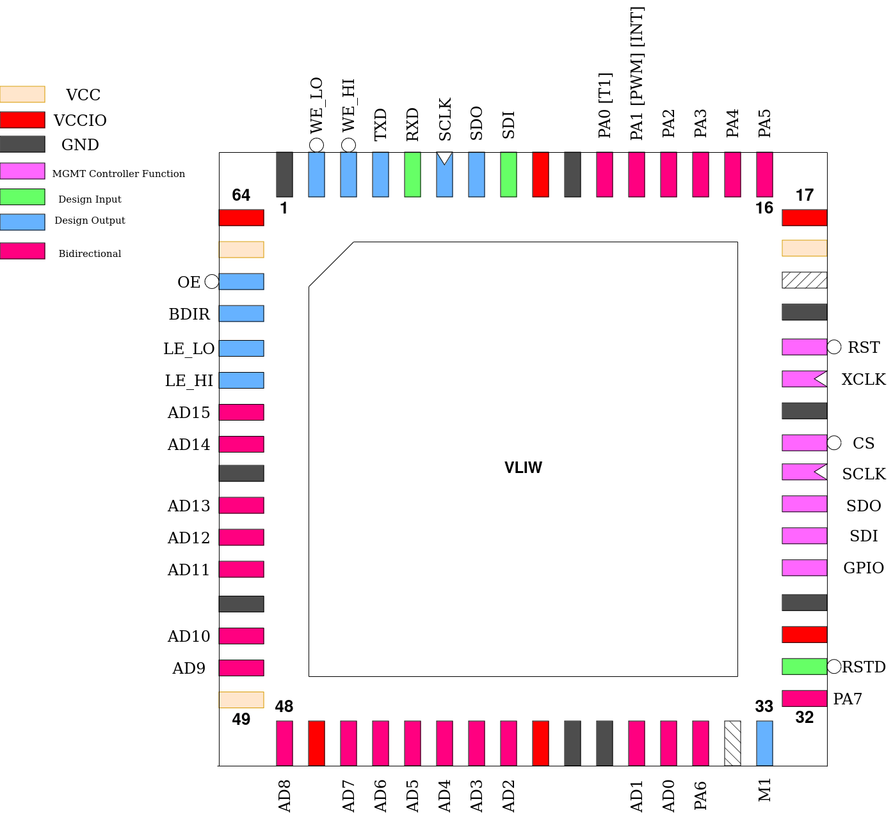

.. _vliw:

VLIW
====

This design is a Very Long Instruction Word, Explicitly Parallel, 32-bit microprocessor. It fetches instructions in "packs" of 3 opcodes, totalling a 128-bit instruction word. These are, unless otherwise specified by breaks, executed in parallel in 3 execution units.

Due to the RISC instruction set making every instruction except divide single-cycle, this results in up to 3 instructions executed in a single clock cycle during the execution step. This makes memory bandwidth the limiting factor, so a set of 63 general-purpose registers is provided, together with a 32 entry wide instruction cache.

------
Pinout
------

.. list-table:: Pin description
    :name: pin-description-vliw
    :header-rows: 1

    * - Pin #
      - Name
      - Type
      - Summary
    * - ``mprj_io[0]``
      - RSTD
      - I
      - Active low design reset
    * - ``mprj_io[1]``
      - PA[7]
      - IO
      - GPIO Port A, bit 7
    * - ``mprj_io[2]``
      - M1
      - O
      - Pulses high during each instruction execution
    * - ``mprj_io[4]``
      - PA[6]
      - IO
      - GPIO Port A, bit 6
    * - ``mprj_io[20:5]``
      - AD[15:0]
      - IO
      - Bi-directional, multiplexed address/data bus
    * - ``mprj_io[21]``
      - LE_HI
      - O
      - Address Latch Enable, MSBs
    * - ``mprj_io[22]``
      - LE_LO
      - O
      - Address Latch Enable, LSBs
    * - ``mprj_io[23]``
      - BDIR
      - O
      - Indicates current direction of bus lines
    * - ``mprj_io[24]``
      - OE
      - O
      - Memory Output Enable
    * - ``mprj_io[25]``
      - WE_LO
      - O
      - Memory Write Enable, MSBs
    * - ``mprj_io[26]``
      - WE_HI
      - O
      - Memory Write Enable, LSBs
    * - ``mprj_io[27]``
      - TXD
      - O
      - UART Serial Transmit
    * - ``mprj_io[28]``
      - RXD
      - I
      - UART Serial Receive
    * - ``mprj_io[29]``
      - SCLK
      - O
      - SPI Master Serial Clock
    * - ``mprj_io[30]``
      - SDO
      - O
      - SPI Master Serial Data Out
    * - ``mprj_io[31]``
      - SDI
      - I
      - SPI Master Serial Data In
    * - ``mprj_io[32]``
      - PA[0]
      - IO
      - GPIO Port A, bit 0, with Timer Output alternate function
    * - ``mprj_io[33]``
      - PA[1]
      - IO
      - GPIO Port A, bit 1, with PWM Output or Interrupt Input alternate functions
    * - ``mprj_io[37:34]``
      - PA[5:2]
      - IO
      - GPIO Port A, bits 2-5
